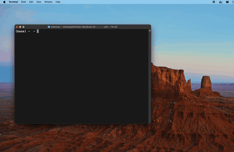

## emex

Emex helps you run a chat with an LLM locally, via a terminal.

### Currently Supported Models:

- microsoft/phi-2
- gemma-2b

All models currently used are using models from the mlx-community. Other models from mlx-community within hugginface should work out of the box but are yet to be tested. 

The cli uses mlx_lm and mlx to generate text

### Features

- Generate text using local LLMs via MLX
- Verbose mode to print metrics like Tokens/Sec, (TTFS) Time to first token & Total Time taken for generation

